# BuildSystemZero2One
1. [Vagrant](#vagrant)
2. [Oracle VM Virtualbox](#virtualbox)
3. [Centos(Vagrant+Oracle VM Virtualbox)](#centos)
4. [Docker](#docker)
5. [Nginx](#nginx)
6. [Openresty](#openresty)
7. [Redis](#redis)
8. [Mysql](#mysql)
9. [GitLab](#gitLab)
10. [Jenkins](#jenkins)
11. [Swagger](#swagger)
12. [SpringBoot](#springBoot)
13. [Redis+Lua](#redisLua)
14. [Jmeter](#jmeter)

## Vagrant
1.Download url
https://www.vagrantup.com/downloads.html
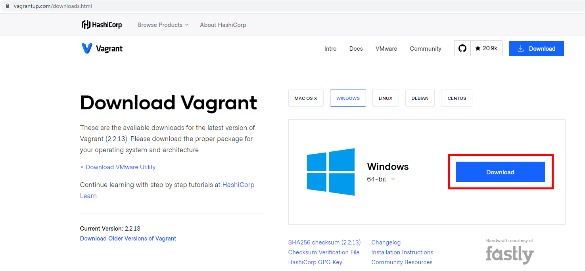

2.install 
 
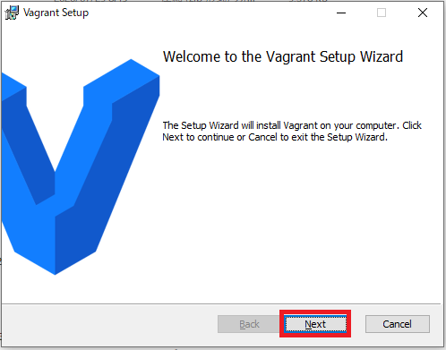 
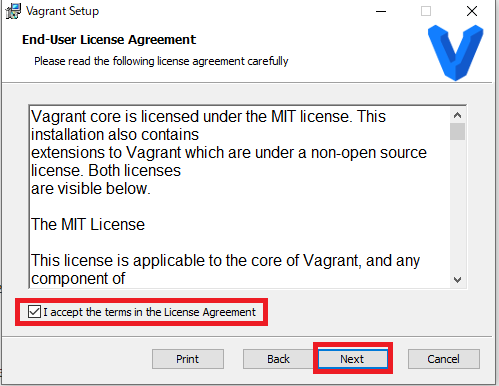 
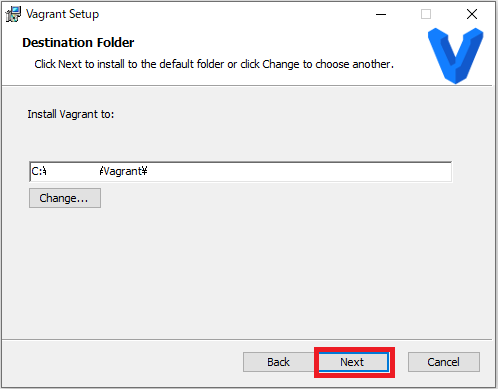 
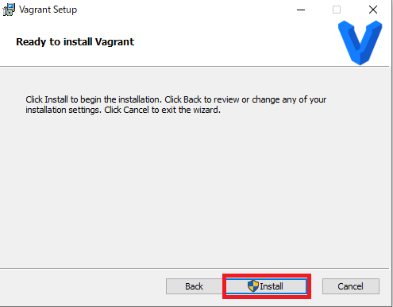 
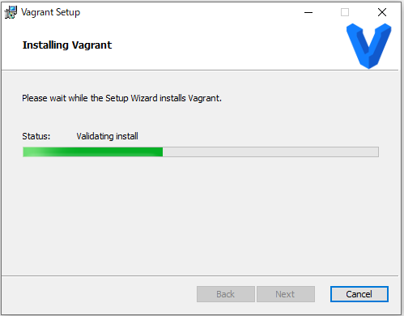 
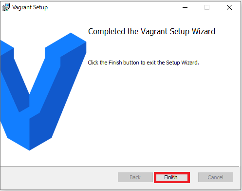 
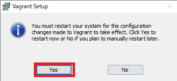 
 
 

## Oracle VM Virtualbox
1.Download url
https://www.virtualbox.org/wiki/Downloads

2.install 
 
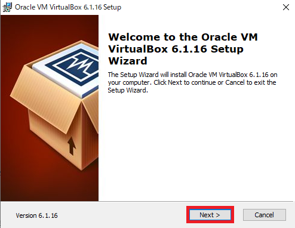 
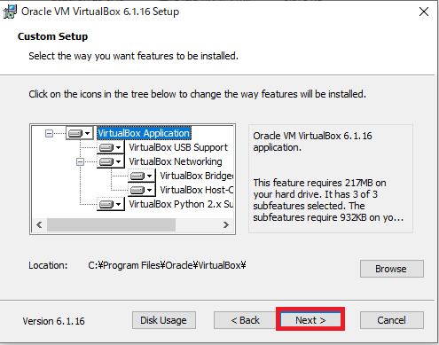 
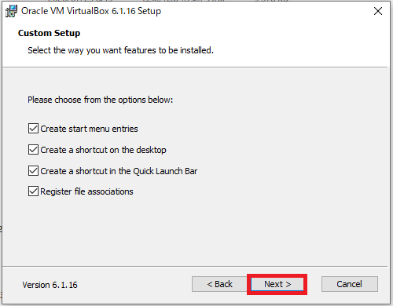 
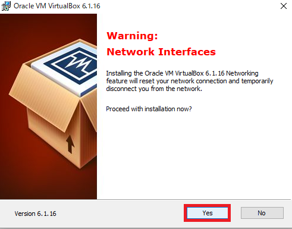 
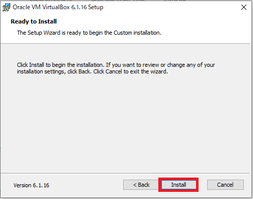 
 
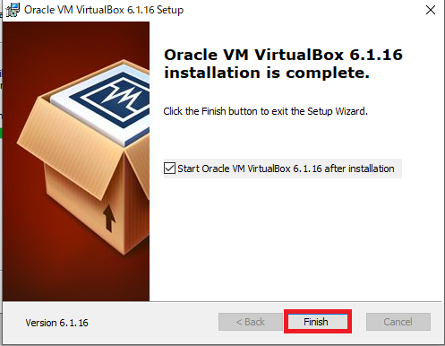 
 
 

## Centos(Vagrant+Oracle VM Virtualbox)
1.search and confirm centos version from vagrant repository 
vagrant repository url: https://app.vagrantup.com/boxes/search 
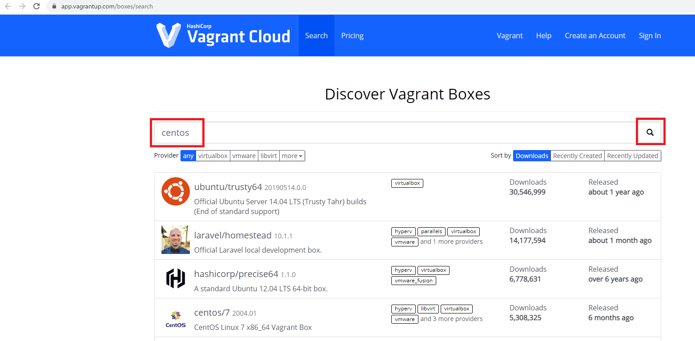 
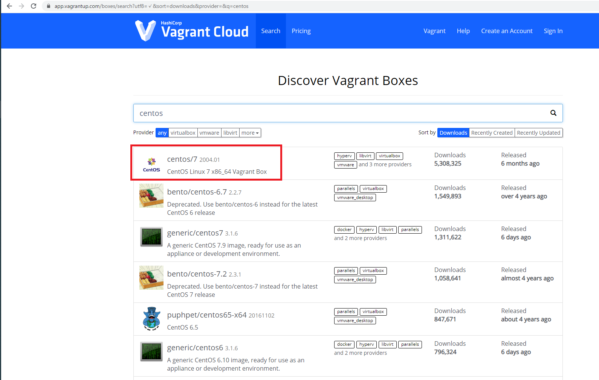 

2.init centos  
command:
>vagrant init centos/7
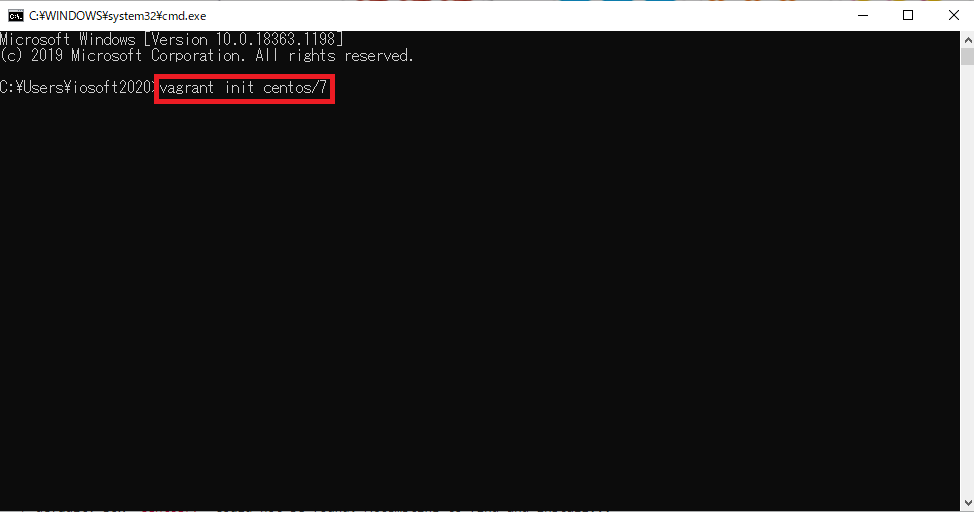 
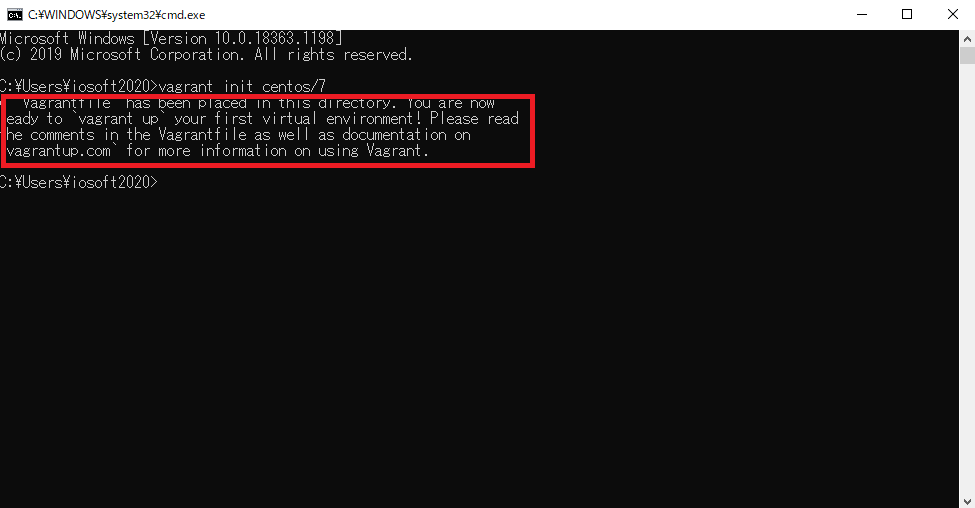 

3.open C:\Users\xxxx and confirm Vagrantfile 
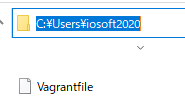 

4.install vagrant-disksize plugin for specify the disk size 
command:vagrant plugin install vagrant-disksize 
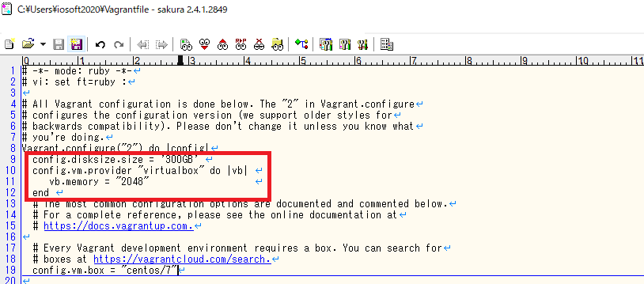 
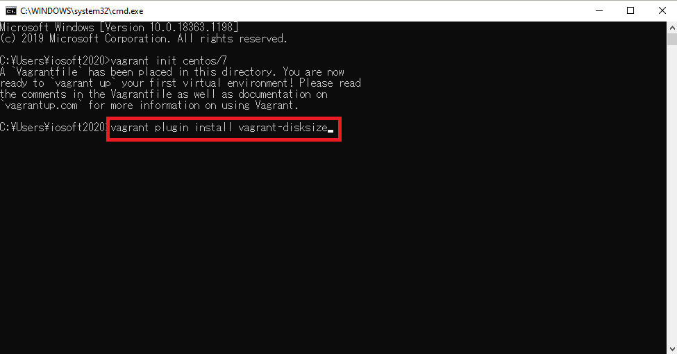 

5.edit Vagrantfile for specify the disk and memory size and ip 
add: 
  config.disksize.size = '300GB'  
  config.vm.provider "virtualbox" do |vb|  
     vb.memory = "2048"                    
  end  
  config.vm.network "private_network", ip: "192.168.56.66" 
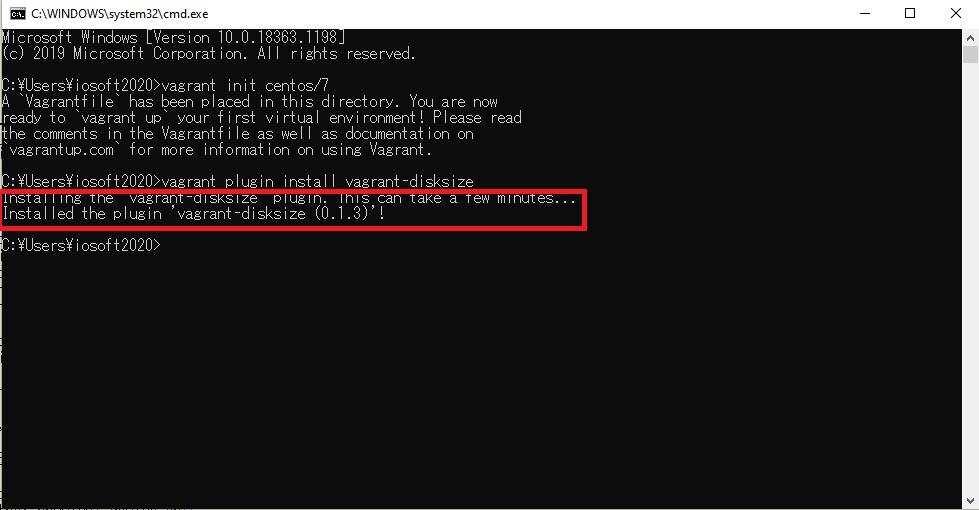 

6.auto download centos and start  
command:vagrant up 
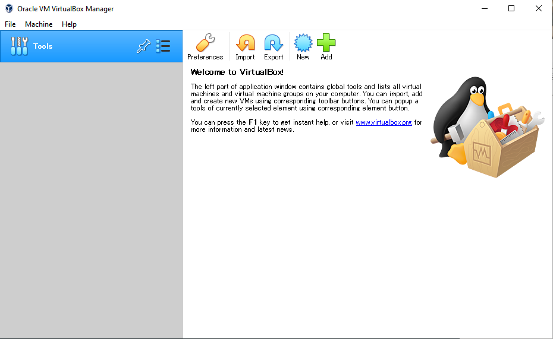 
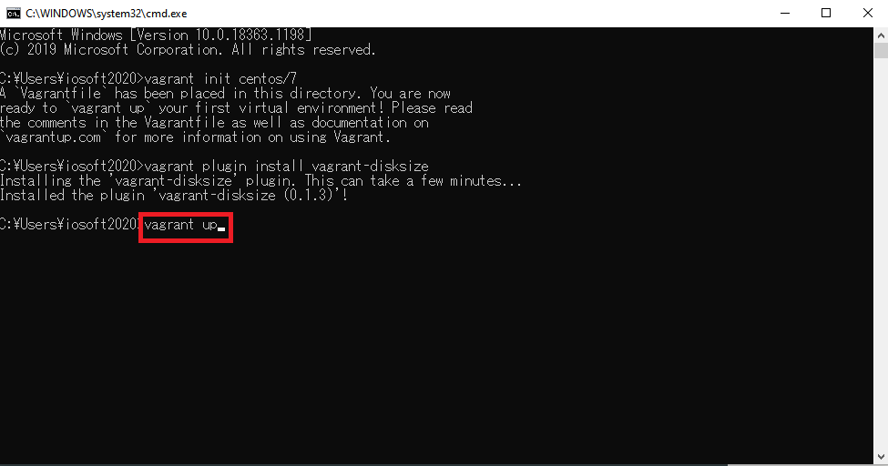 
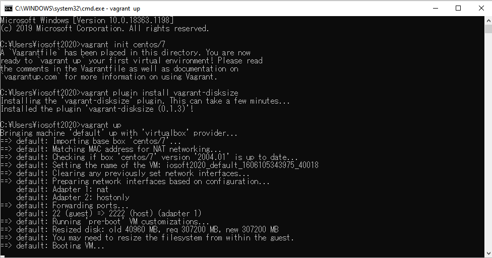 

6.ssh  
command:vagrant ssh 
root default password :vagrant 
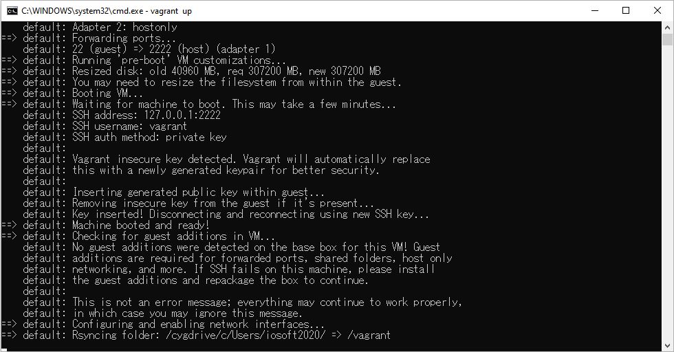 
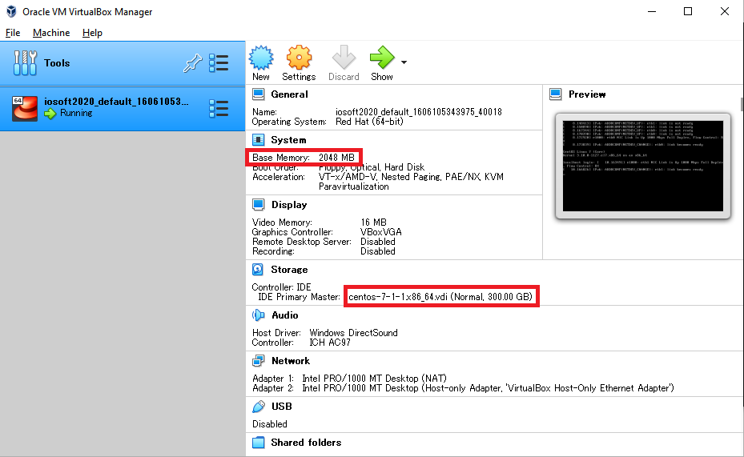 

 
 

## Docker
 
 

## Nginx
 
 

## Openresty
 
 

## Redis
 
 

## Mysql
 
 

## GitLab
 
 

## Jenkins
 
 

## Swagger
 
 

## SpringBoot
 
 

## Redis+Lua
 
 

## Jmeter
 
 
