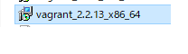
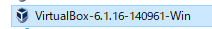
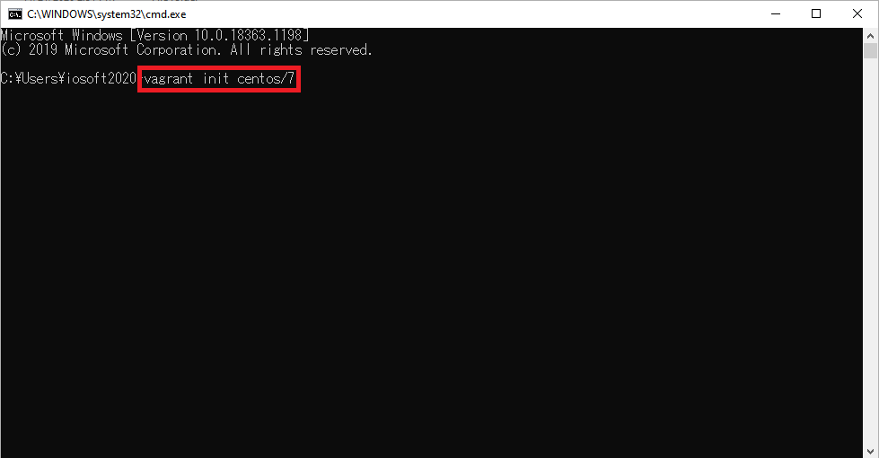
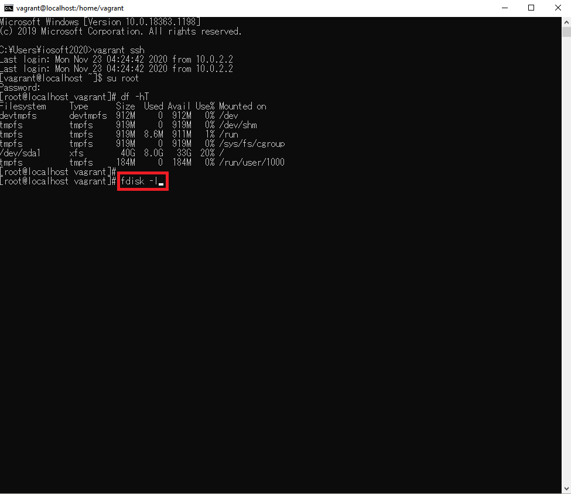
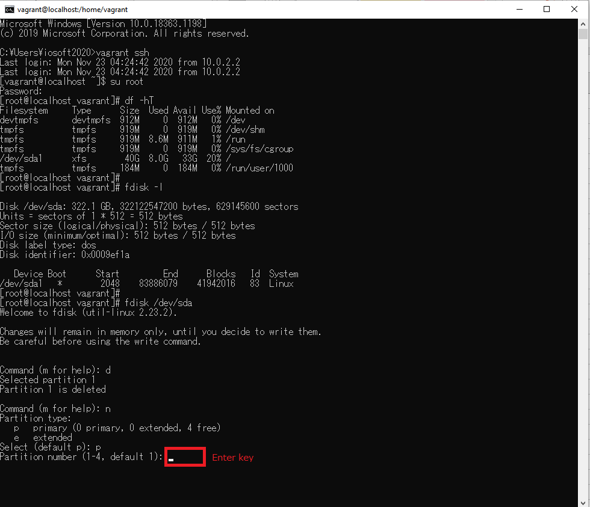

# BuildSystemZero2One
- [Vagrant](#vagrant)
  - [Download](#vagrant_download)
  - [Install](#vagrant_install)
- [Oracle VM Virtualbox](#virtualbox)
  - [Download](#virtualbox_download)
  - [Install](#virtualbox_install)
- [Centos(Vagrant+Oracle VM Virtualbox)](#centos)
- [Docker](#docker)
- [Nginx](#nginx)
- [Openresty](#openresty)
- [Redis](#redis)
- [Mysql](#mysql)
- [GitLab](#gitLab)
- [Jenkins](#jenkins)
- [Swagger](#swagger)
- [SpringBoot](#springBoot)
- [Redis+Lua](#redisLua)
- [Jmeter](#jmeter)

## Vagrant

- Download 
Download url 
>https://www.vagrantup.com/downloads.html

- Install 
 
 
 
 
 
 
 
 
 
 

## Oracle VM Virtualbox

- Download 
Download url 
>https://www.virtualbox.org/wiki/Downloads

- Install 
 
 
 
 
 
 
 
 
 
 

## Centos(Vagrant+Oracle VM Virtualbox)
- search and confirm centos version from vagrant repository 
vagrant repository url: 
>https://app.vagrantup.com/boxes/search 

 
 

- init centos  

>vagrant init centos/7

 
 

- open C:\Users\xxxx and confirm Vagrantfile 
 

- edit Vagrantfile for specify the disk and the memory size and ip 

>  config.disksize.size = '300GB' 
>  config.vm.provider "virtualbox" do |vb|  
>     vb.memory = "2048"                    
>  end  
>
>  config.vm.network "private_network", ip: "192.168.56.66" 

 

- Vagrant install vagrant-disksize plugin 
>vagrant plugin install vagrant-disksize

 
 

- auto download centos and start  

 

>vagrant up 

 
 
 

- Confirm resize status  

 

- Ssh and use root login  

>vagrant ssh 

 

>su root 
root default password  
>vagrant 

 

- format the new disk
>df -hT 

 
 

>fdisk -l 

 
 

>fdisk /dev/sda 

 

>d 

 

>n 

 

>p 

 

>Enter key 

 

>Enter key 

 

>Enter key 

 

>p 

 

>w 

 
 

>rebbot 

 

>df -hT 

 
 

>xfs_growfs / -d 

 
 

>df -hT 

 
 

 
 

## Docker
 
 

## Nginx
 
 

## Openresty
 
 

## Redis
 
 

## Mysql
 
 

## GitLab
 
 

## Jenkins
 
 

## Swagger
 
 

## SpringBoot
 
 

## Redis+Lua
 
 

## Jmeter
 
 
