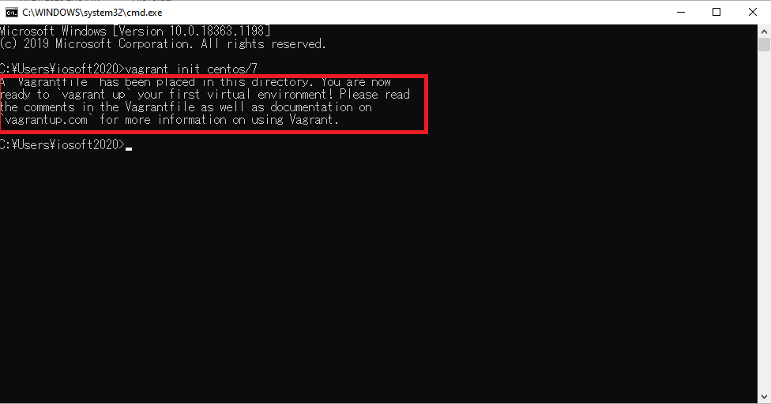
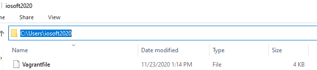
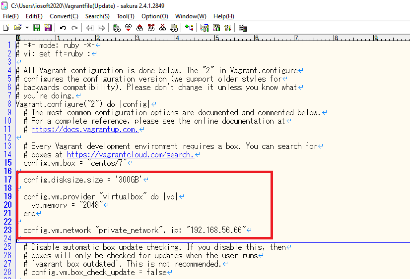
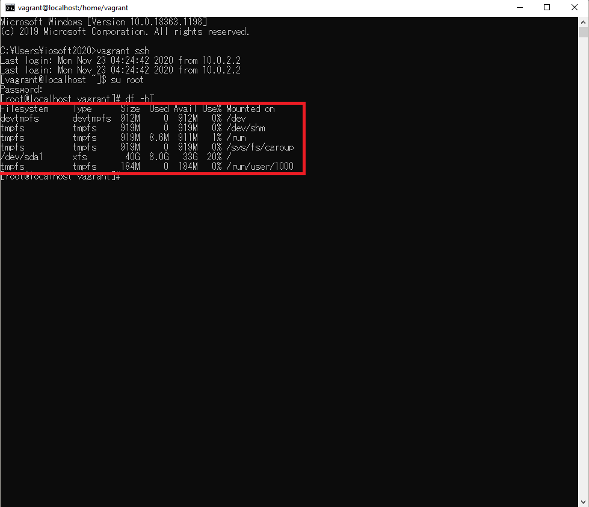
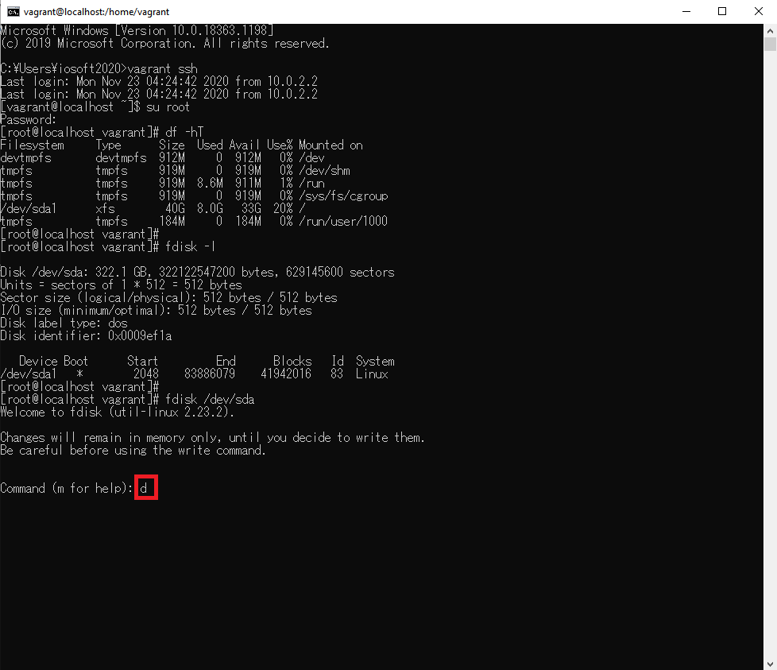
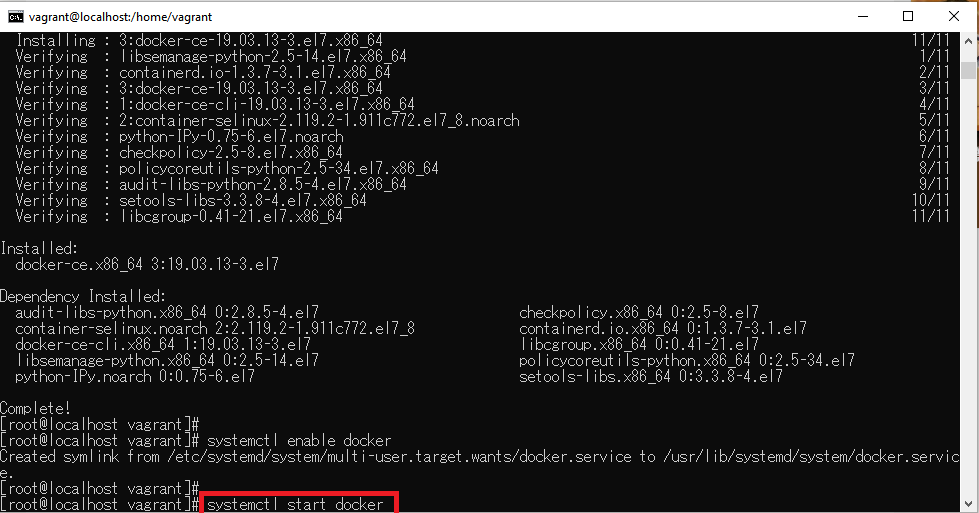

# BuildSystemZero2One
- [Vagrant](#vagrant)
  - [Download](#vagrant_download)
  - [Install](#vagrant_install)
- [Oracle VM Virtualbox](#virtualbox)
  - [Download](#virtualbox_download)
  - [Install](#virtualbox_install)
- [Centos(Vagrant+Oracle VM Virtualbox)](#centos)
  - [Search and confirm centos version from vagrant repository](#centos_search_and_confirm_centos_version_from_vagrant_repository)
  - [Init centos](#centos_init_centos)
  - [Open user dir and confirm Vagrantfile](#centos_open_user_dir_confirm_Vagrantfile)
  - [Edit Vagrantfile for specify the disk and the memory size and ip](#centos_edit_Vagrantfile_for_specify_the_disk_and_the_memory_size_and_ip)
  - [Install vagrant-disksize plugin](#centos_install_vagrant_disksize_plugin)
  - [Auto download centos and start](#centos_auto_download_centos_and_start)
  - [Confirm resize status](#centos_confirm_resize_status)
  - [Ssh and use root login](#centos_ssh_and_use_root_login)
  - [Format the new disk](#centos_format_the_new_disk)
- [Docker](#docker)
  - [Remove default docker](#docker_remove_default_docker)
  - [Install dependent package](#docker_install_dependent_package)
  - [Set docker download repository](#docker_set_docker_download_repository)
  - [Update yum package index](#docker_update_yum_package_index)
  - [Install docker](#docker_install_docker)
  - [Start docker when system start](#docker_start_docker_when_system_start)
  - [Start docker](#docker_start_docker)
  - [Confirm docker version](#docker_confirm_docker_version)
- [Lua](#lua)
  - [Confirm version and view install command](#lua_confirm_version_and_view_install_command)
  - [Install Gcc](#lua_install_gcc)
  - [Install](#lua_install)
- [Nginx](#nginx)
  - [Install by docker](#nginx_install_by_docker)
- [Openresty](#openresty)
- [Redis](#redis)
- [Mysql](#mysql)
- [GitLab](#gitLab)
- [Jenkins](#jenkins)
- [Swagger](#swagger)
  - [Maven dependency](#swagger_maven_dependency)
  - [Localhost Url](#swagger_localhost_url)
  - [Configuretion(Java)](#swagger_configuretion_java)
  - [Annotation example](#swagger_annotation_example)
      - [Controller](#swagger_annotation_example_controller)
      - [Model](#swagger_annotation_example_model)
  - [UI images](#swagger_ui_images)
  
- [SpringBoot](#springBoot)
- [Redis+Lua](#redisLua)
- [Jmeter](#jmeter)

<a id="vagrant"></a>
## Vagrant

<a id="vagrant_download"></a>
- Download</br>
Download url</br>
>https://www.vagrantup.com/downloads.html


<a id="vagrant_install"></a>
- Install</br>
</br>
</br>
</br>
</br>
</br>
</br>
</br>
</br>
</br>
</br>

<a id="virtualbox"></a>
## Oracle VM Virtualbox
<a id="virtualbox_download"></a>
- Download</br>
Download url</br>
>https://www.virtualbox.org/wiki/Downloads


<a id="virtualbox_install"></a>
- Install</br>
</br>
</br>
</br>
</br>
</br>
</br>
</br>
</br>
</br>
</br>

<a id="centos"></a>
## Centos(Vagrant+Oracle VM Virtualbox)
<a id="centos_search_and_confirm_centos_version_from_vagrant_repository"></a>
- Search and confirm centos version from vagrant repository</br>
vagrant repository url:</br>
>https://app.vagrantup.com/boxes/search</br>

</br>
</br>

<a id="centos_init_centos"></a>
- Init centos </br>

>vagrant init centos/7

</br>
</br>

<a id="centos_open_user_dir_confirm_Vagrantfile"></a>
- Open C:\Users\xxxx and confirm Vagrantfile</br>
</br>

<a id="centos_edit_Vagrantfile_for_specify_the_disk_and_the_memory_size_and_ip"></a>
- Edit Vagrantfile for specify the disk and the memory size and ip</br>

>  config.disksize.size = '300GB'</br>
>  config.vm.provider "virtualbox" do |vb| </br>
>     vb.memory = "2048"                   </br>
>  end </br>
>
>  config.vm.network "private_network", ip: "192.168.56.66"</br>

</br>

<a id="centos_install_vagrant_disksize_plugin"></a>
- Install vagrant-disksize plugin</br>
>vagrant plugin install vagrant-disksize

</br>
</br>

<a id="centos_auto_download_centos_and_start"></a>
- Auto download centos and start </br>

</br>

>vagrant up</br>

</br>
</br>
</br>

<a id="centos_confirm_resize_status"></a>
- Confirm resize status </br>

</br>

<a id="centos_ssh_and_use_root_login"></a>
- Ssh and use root login </br>

>vagrant ssh</br>

</br>

>su root(root default password:vagrant)</br>

</br>

<a id="centos_format_the_new_disk"></a>
- Format the new disk
>df -hT</br>

</br>
</br>

>fdisk -l</br>

</br>
</br>

>fdisk /dev/sda</br>

</br>

>d</br>

</br>

>n</br>

</br>

>p</br>

</br>

>Enter key</br>

</br>

>Enter key</br>

</br>

>Enter key</br>

</br>

>p</br>

</br>

>w</br>

</br>
</br>

>reboot</br>

</br>

>su root</br>
>df -hT</br>

</br>
</br>

>xfs_growfs / -d</br>

</br>
</br>

>df -hT</br>

</br>
</br>


</br>
</br>

<a id="docker"></a>
## Docker

<a id="docker_remove_default_docker"></a>
- Remove default docker
>yum remove docker docker-common docker-selinux docker-engine</br>

</br>
</br>

<a id="docker_install_dependent_package"></a>
- Install dependent package
>yum install -y yum-utils device-mapper-persistent-data lvm2</br>

</br>
</br>
</br>

<a id="docker_set_docker_download_repository"></a>
- Set docker download repository
>yum-config-manager --add-repo https://download.docker.com/linux/centos/docker-ce.repo</br>

</br>
</br>

<a id="docker_update_yum_package_index"></a>
- Update yum package index
>yum makecache fast</br>

</br>
</br>

<a id="docker_install_docker"></a>
- Install docker
>yum install docker-ce</br>

</br>
</br>
</br>
</br>

<a id="docker_start_docker_when_system_start"></a>
- Start docker when system start
>systemctl enable docker</br>

</br>

<a id="docker_start_docker"></a>
- Start docker
>systemctl start docker</br>

</br>
</br>

<a id="docker_confirm_docker_version"></a>
- Confirm docker version
>docker version</br>

</br>
</br>

</br>
</br>

<a id="lua"></a>
## Lua
<a id="lua_confirm_version_and_view_install_command"></a>
- Confirm version and view install command</br>
Url</br>
>https://www.lua.org</br>


<a id="lua_install_gcc"></a>
- Install Gcc</br>
>yum -y install gcc</br>


<a id="lua_install"></a>
- Install</br>

>curl -R -O http://www.lua.org/ftp/lua-5.4.2.tar.gz</br>


>tar zxf lua-5.4.2.tar.gz</br>


>cd lua-5.4.2</br>


>make all test</br>


>lua -v</br>


<a id="nginx"></a>
## Nginx
<a id="nginx_install_by_docker"></a>
- Install by docker</br>

>mkdir -p /usr/local/nginx/www /usr/local/nginx/logs /usr/local/nginx/conf</br>


>docker pull nginx</br>


>docker run -d -p 9001:80 --name mynginx nginx</br>


>docker cp mynginx:/etc/nginx/nginx.conf /usr/local/nginx/conf/mynginx.conf</br>


>ll /usr/local/nginx/conf/mynginx.conf</br>


>docker stop mynginx</br>


>docker rm mynginx</br>


>docker run -p 9001:80 --name mynginx \</br>
>-v /usr/local/nginx/www:/usr/share/nginx/html \</br>
>-v /usr/local/nginx/logs:/var/log/nginx \</br>
>-v /usr/local/nginx/conf/mynginx.conf:/etc/nginx/nginx.conf \</br>
>-d nginx</br>


>docker ps -a</br>


</br>
</br>

<a id="openresty"></a>
## Openresty
</br>
</br>
<a id="redis"></a>

## Redis
</br>
</br>
<a id="mysql"></a>

## Mysql
</br>
</br>

<a id="gitLab"></a>
## GitLab
</br>
</br>

<a id="jenkins"></a>
## Jenkins
</br>
</br>

<a id="swagger"></a>
## Swagger
<a id="swagger_maven_dependency"></a>
- Maven dependency
>        <dependency></br>
>            <groupId>io.springfox</groupId></br>
>            <artifactId>springfox-swagger2</artifactId></br>
>            <version>2.9.2</version></br>
>        </dependency></br>
>
>        <dependency></br>
>            <groupId>io.springfox</groupId></br>
>            <artifactId>springfox-swagger-ui</artifactId></br>
>            <version>2.9.2</version></br>
>        </dependency></br>

<a id="swagger_localhost_url"></a>
- Localhost url</br>
>http://localhost:8080/swagger-ui.html

<a id="swagger_configuretion_java"></a>
- Configuretion(Java)
```java
package com.iosoft2020.MySwagger.config;

import java.util.ArrayList;

import org.springframework.context.annotation.Bean;
import org.springframework.context.annotation.Configuration;
import org.springframework.core.env.Environment;
import org.springframework.core.env.Profiles;

import springfox.documentation.builders.PathSelectors;
import springfox.documentation.builders.RequestHandlerSelectors;
import springfox.documentation.service.ApiInfo;
import springfox.documentation.service.Contact;
import springfox.documentation.spi.DocumentationType;
import springfox.documentation.spring.web.plugins.Docket;
import springfox.documentation.swagger2.annotations.EnableSwagger2;

@Configuration
@EnableSwagger2
public class MySwaggerConfig {

    @Bean
    public Docket docker(Environment environment) {

        Profiles profiles = Profiles.of("dev", "test");
        environment.acceptsProfiles(profiles);

        return new Docket(DocumentationType.SWAGGER_2).apiInfo(apiInfo())
                //				.enable(environment.acceptsProfiles(profiles))
                .groupName("group1")
                .select()
                // withMethodAnnotation
                .apis(RequestHandlerSelectors.basePackage("com.iosoft2020.MySwagger.controller"))
                //				.paths(PathSelectors.ant("/iosoft2020/**"))
                .build();
    }

    @Bean
    public Docket dockerGroupA(Environment environment) {

        return new Docket(DocumentationType.SWAGGER_2).apiInfo(apiInfo())
                //				.enable(environment.acceptsProfiles(profiles))
                .groupName("groupA")
                .select()
                // withMethodAnnotation
                .apis(RequestHandlerSelectors.basePackage("com.iosoft2020.MySwagger.controller"))
                .paths(PathSelectors.ant("/iosoft2020/**"))
                .build();
    }

    private ApiInfo apiInfo() {

        Contact contack = new Contact("iosoft2020", "https://github.com/iosoft2020/BuildSystemZero2One",
                "xxx@xxx.com");

        return new ApiInfo("MySwaggerAPI Document", "MySwaggerApi", "1.0",
                "https://github.com/iosoft2020/BuildSystemZero2One/blob/main/README.md#swagger",
                contack, "Apache 2.0", "http://www.apache.org/licenses/LICENSE-2.0",
                new ArrayList<>());
    }
}
```

<a id="swagger_annotation_example"></a>
- Annotation example

<a id="swagger_annotation_example_controller"></a>
- Controller
```java
package com.iosoft2020.MySwagger.controller;

import java.util.ArrayList;
import java.util.List;

import org.springframework.web.bind.annotation.GetMapping;
import org.springframework.web.bind.annotation.PostMapping;
import org.springframework.web.bind.annotation.RestController;

import com.iosoft2020.MySwagger.pojo.User;
import com.iosoft2020.MySwagger.response.ErrorResponse;

import io.swagger.annotations.Api;
import io.swagger.annotations.ApiOperation;
import io.swagger.annotations.ApiParam;
import io.swagger.annotations.ApiResponse;
import io.swagger.annotations.ApiResponses;

@RestController
@Api(tags = "Module One API")
public class ModuleOneController {

    @ApiOperation(value = "login", notes = "get username and password")
    @GetMapping("login")
    public String login(@ApiParam("user name") String username, @ApiParam("password") String password) {
        return "welcome. ";
    }

    @ApiOperation(value = "findUser", notes = "find user")
    @ApiResponses(value = {
            @ApiResponse(code = 200, message = "user", response = User.class),
            @ApiResponse(code = 400, message = "invalid parm", response = ErrorResponse.class)
    })
    @PostMapping("findUser")
    public User findUser(String username) {
        return new User();
    }

    @ApiOperation(value = "say hello", notes = "say hello by name")
    @PostMapping("sayHello")
    public String sayHello(@ApiParam("user name") String username) {
        return "hello " + username;
    }

    @ApiOperation(value = "findUsers", notes = "find users")
    @ApiResponse(code = 200, message = "find users", response = User.class, responseContainer = "List")
    @PostMapping("findUsers")
    public List<User> findUsers(String username) {
        return new ArrayList<User>();
    }

}
```

<a id="swagger_annotation_example_model"></a>
- Model
```java
package com.iosoft2020.MySwagger.pojo;

import io.swagger.annotations.ApiModel;
import io.swagger.annotations.ApiModelProperty;

@ApiModel("user pojo")
public class User {

	@ApiModelProperty("user name")
	public String username;

	@ApiModelProperty("password")
	public String password;
}
```

<a id="swagger_ui_images"></a>
- UI images</br>
</br>
</br>
</br>

</br>
</br>
<a id="springBoot"></a>

## SpringBoot
</br>
</br>

<a id="redisLua"></a>
## Redis+Lua
</br>
</br>

<a id="jmeter"></a>
## Jmeter
</br>
</br>
