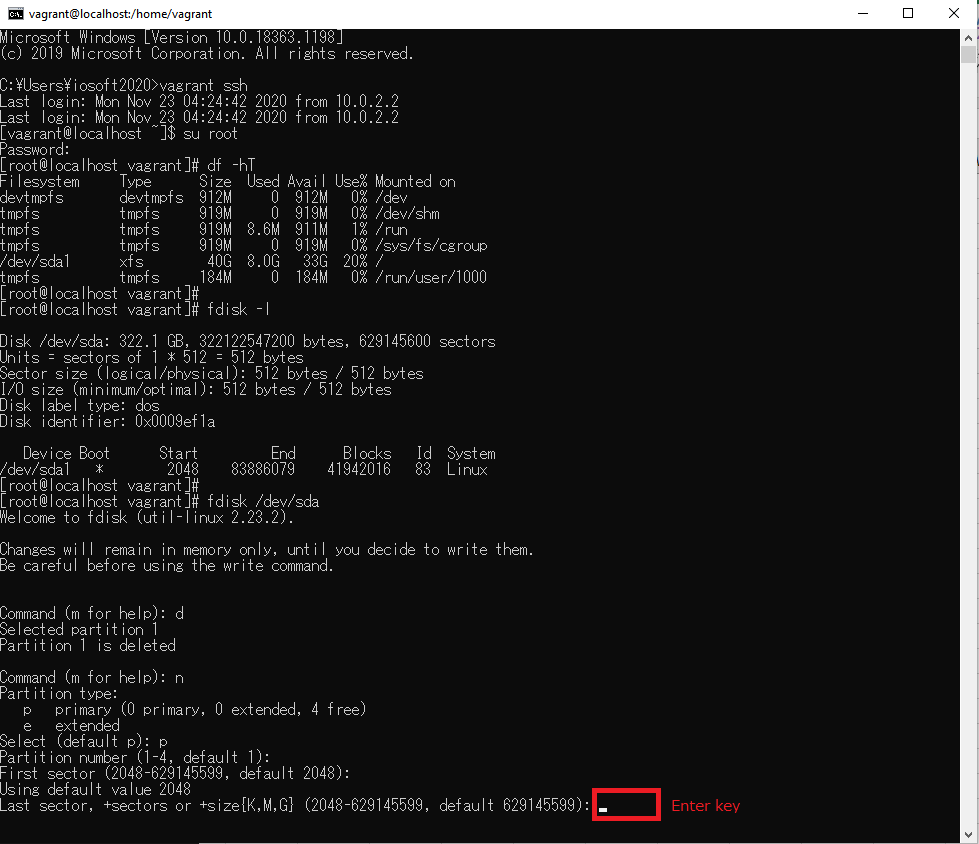

# BuildSystemZero2One
1. [Vagrant](#vagrant)
2. [Oracle VM Virtualbox](#virtualbox)
3. [Centos(Vagrant+Oracle VM Virtualbox)](#centos)
4. [Docker](#docker)
5. [Nginx](#nginx)
6. [Openresty](#openresty)
7. [Redis](#redis)
8. [Mysql](#mysql)
9. [GitLab](#gitLab)
10. [Jenkins](#jenkins)
11. [Swagger](#swagger)
12. [SpringBoot](#springBoot)
13. [Redis+Lua](#redisLua)
14. [Jmeter](#jmeter)

## Vagrant
- Download url 
>https://www.vagrantup.com/downloads.html

- install 
 
 
 
 
 
 
 
 
 
 

## Oracle VM Virtualbox
- Download url 
>https://www.virtualbox.org/wiki/Downloads

- install 
 
 
 
 
 
 
 
 
 
 

## Centos(Vagrant+Oracle VM Virtualbox)
- search and confirm centos version from vagrant repository 
vagrant repository url: 
>https://app.vagrantup.com/boxes/search 

 
 

- init centos  

>vagrant init centos/7

 
 

- open C:\Users\xxxx and confirm Vagrantfile 
 

- edit Vagrantfile for specify the memory size and ip 

>  config.vm.provider "virtualbox" do |vb|  
>     vb.memory = "2048"                    
>  end  
>
>  config.vm.network "private_network", ip: "192.168.56.66" 

 

- auto download centos and start  

>vagrant up

 
 
 

- ssh  

>vagrant ssh

root default password 
>vagrant

 
 

- increase disk size on a Vagrant VM using VirtualBox
 
 
 
 

>"C:\Program Files\Oracle\VirtualBox\VBoxManage.exe" clonehd centos-7-1-1.x86_64.vmdk centos-7-1-1.x86_64_clone.vdi --format vdi 

 
 

>"C:\Program Files\Oracle\VirtualBox\VBoxManage.exe" modifyhd centos-7-1-1.x86_64_clone.vdi compact 

 

>"C:\Program Files\Oracle\VirtualBox\VBoxManage.exe" modifyhd centos-7-1-1.x86_64_clone.vdi --resize 307200 

 

>"C:\Program Files\Oracle\VirtualBox\VBoxManage.exe" clonehd centos-7-1-1.x86_64_clone.vdi centos-7-1-1.x86_64_vdi_2_vmdk.vmdk --format vmdk 

 
 
 
 
 
 
 
 
 

 
 

## Docker
 
 

## Nginx
 
 

## Openresty
 
 

## Redis
 
 

## Mysql
 
 

## GitLab
 
 

## Jenkins
 
 

## Swagger
 
 

## SpringBoot
 
 

## Redis+Lua
 
 

## Jmeter
 
 
